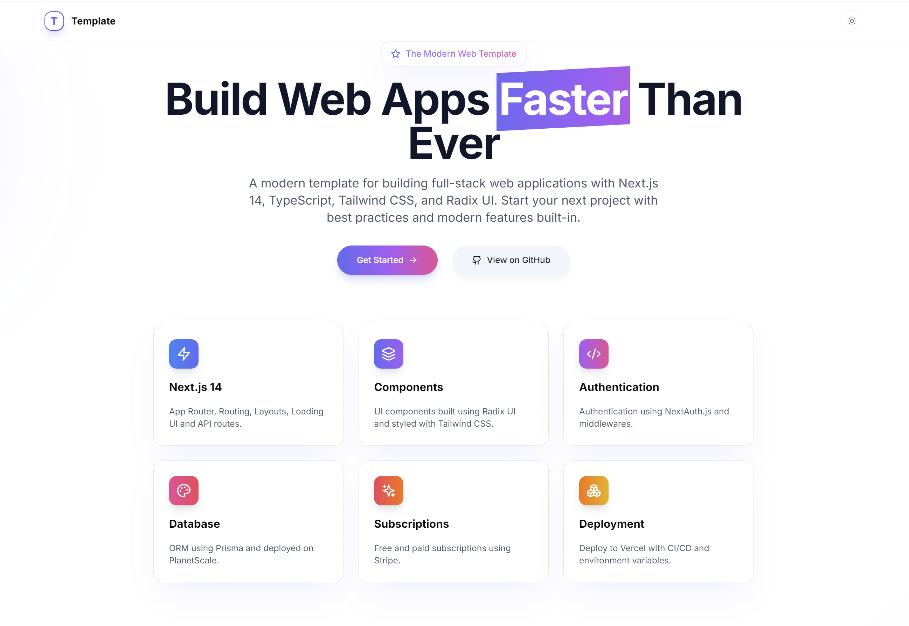

# Modern Web Template

A modern, full-stack web application template built with Next.js 14, TypeScript, Tailwind CSS, and Radix UI. This template provides everything you need to build production-ready applications with best practices and modern features built-in.



## ✨ Features

- 🚀 **Next.js 14** - Latest features including App Router, Server Components, and API Routes
- 💎 **TypeScript** - Type safety and enhanced developer experience
- 🎨 **Tailwind CSS** - Utility-first CSS framework for rapid UI development
- 🔥 **Radix UI** - Accessible and customizable component primitives
- 🌙 **Dark Mode** - Built-in dark mode with system preference detection
- 🎭 **Authentication** - Ready-to-use authentication with NextAuth.js
- 💾 **Database** - Prisma ORM with PlanetScale integration
- 💳 **Payments** - Stripe integration for subscription handling
- 🚢 **CI/CD** - GitHub Actions workflow for automated testing and deployment
- 📱 **Responsive** - Mobile-first design approach
- ♿ **Accessibility** - WCAG compliant components
- 🔍 **SEO** - Built-in SEO optimization with next-sitemap

## 🚀 Getting Started

1. Clone the repository:
```bash
git clone https://github.com/yourusername/modern-web-template.git
cd modern-web-template
```

2. Install dependencies:
```bash
npm install
# or
yarn install
# or
pnpm install
```

3. Create a `.env` file:
```bash
cp .env.example .env.local
```

4. Start the development server:
```bash
npm run dev
# or
yarn dev
# or
pnpm dev
```

Open [http://localhost:3000](http://localhost:3000) with your browser to see the result.

## 📦 Project Structure

```
.
├── app/                # Next.js 14 App Router
│   ├── api/           # API Routes
│   ├── (auth)/        # Authentication pages
│   └── layout.tsx     # Root layout
├── components/        # React components
│   ├── ui/           # UI components
│   └── layout/       # Layout components
├── lib/              # Utility functions
├── styles/           # Global styles
├── prisma/           # Database schema
└── public/           # Static assets
```

## 🛠️ Tech Stack

- [Next.js 14](https://nextjs.org/)
- [TypeScript](https://www.typescriptlang.org/)
- [Tailwind CSS](https://tailwindcss.com/)
- [Radix UI](https://www.radix-ui.com/)
- [NextAuth.js](https://next-auth.js.org/)
- [Prisma](https://www.prisma.io/)
- [PlanetScale](https://planetscale.com/)
- [Stripe](https://stripe.com/)

## 📝 Environment Variables

Create a `.env.local` file with the following variables:

```bash
# App
NEXT_PUBLIC_APP_URL=http://localhost:3000

# Authentication (NextAuth.js)
NEXTAUTH_URL=http://localhost:3000
NEXTAUTH_SECRET=your-nextauth-secret

# Database (PlanetScale)
DATABASE_URL=your-database-url

# Stripe
STRIPE_PUBLIC_KEY=your-stripe-public-key
STRIPE_SECRET_KEY=your-stripe-secret-key
```

## 🎯 Scripts

- `dev` - Start development server
- `build` - Build production bundle
- `start` - Start production server
- `lint` - Run ESLint
- `format` - Format code with Prettier
- `type-check` - Run TypeScript type checking
- `test` - Run tests
- `postinstall` - Generate Prisma client

## 🤝 Contributing

Contributions are welcome! Please feel free to submit a Pull Request.

1. Fork the repository
2. Create your feature branch (`git checkout -b feature/amazing-feature`)
3. Commit your changes (`git commit -m 'Add some amazing feature'`)
4. Push to the branch (`git push origin feature/amazing-feature`)
5. Open a Pull Request

## 📄 License

This project is licensed under the MIT License - see the [LICENSE](LICENSE) file for details.

## 🙏 Acknowledgments

- [Vercel](https://vercel.com) - For the amazing deployment platform
- [Tailwind Labs](https://tailwindcss.com) - For the awesome CSS framework
- [Radix UI](https://www.radix-ui.com) - For the accessible component primitives
- [shadcn/ui](https://ui.shadcn.com) - For the beautiful component inspiration 